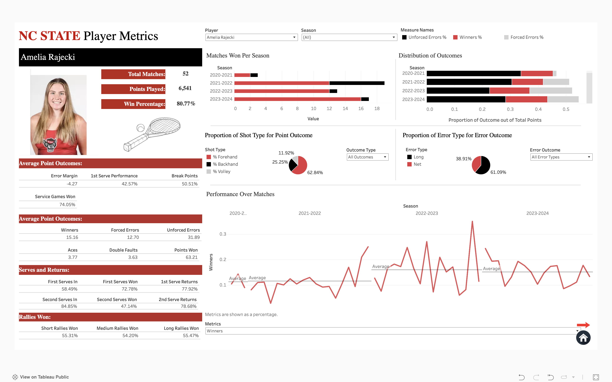
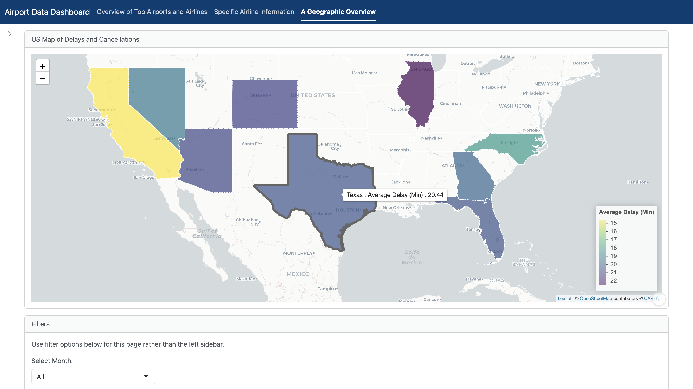
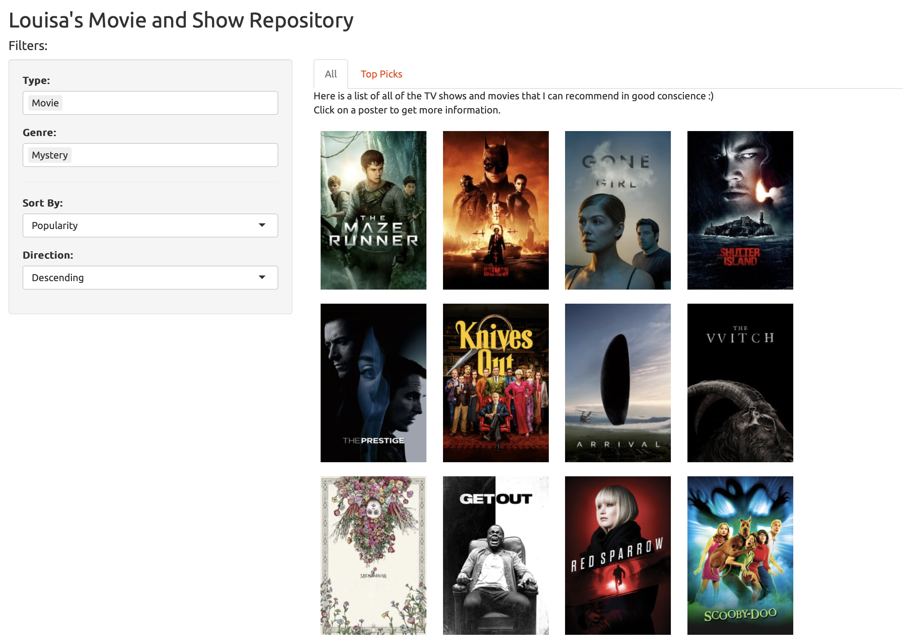

## Technical Skills
**Programming:** Python, R, SQL, VBA    
**Software:** Excel, Tableau, SPSS, Arena Simulation Software, Salesforce      
**Certifications:** PCEP—Certified Entry Level Python Programmer

## Contact Information
**Phone Number:** 919-441-3173     
**Email:** ltswinto@ncsu.edu    
**LinkedIn:** (https://www.linkedin.com/in/louisa-swintosky)

## Education
**M.S. in Analytics** (May 2025)      
Institute for Advanced Analytics | NC State University | Raleigh, NC

**B.S. in Statistics and Analytics; B.A. in Psychology;     
Minor in Neuroscience** _with Highest Distinction_	(May 2023)    
University of North Carolina | Chapel Hill, NC

**About Me**
- I’m Louisa, a data enthusiast with a background in statistics and psychology.
- I'm passionate about data analytics, machine learning, and data ethics, driven by my curiosity for uncovering trends and insights.
- Beyond data, I'm an avid reader, a fan of games, and a movie lover. I also enjoy listening to podcasts, scuba diving, and traveling. 

## Projects

### [NCSU Women's Tennis Dashboard](https://public.tableau.com/app/profile/louisa.swintosky/viz/NCStateWomensTennisMetrics-Orange5/HomePage) _(October 2024)_

Designed and deployed a dashboard in Tableau to visualize NCSU Women's Tennis Team's metric.

_Dashboard Player Card Page_

### [Airport Data Dashboard](https://lswintosky.shinyapps.io/Airport_Data_Dashboard/) _(July 2024)_

Developed an interactive RShiny dashboard analyzing U.S. airline and airport flight data for the top 10 airlines and airports.

_Dashboard Geographic Overview Page_

### [Movie and TV Show Repository: A Collection of My Cinematic Favorites](https://lswintosky.shinyapps.io/MediaRepository/) _(November 2023)_

Created an RShiny dashboard to create a repository of my favorite movies and TV shows as a way to learn RShiny and work with APIs.

_All Page filtered by Movies and Mystery Genre_

### [Wordle Analysis: Exploring Strategies and Optimization](https://github.com/louisaswin/Wordle-Project) _(September 2023)_

**Work:**
- [Groundwater Project](https://github.com/louisaswin/groundwater)

## [Resume](Swintosky_Louisa.pdf)
