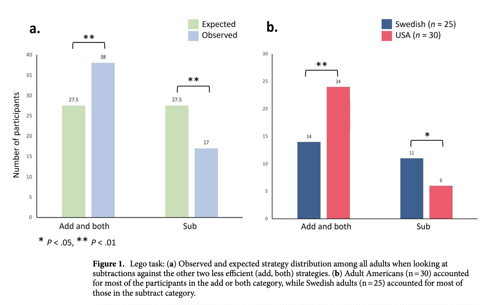

  
  
M.S. Candidate in Analytics at the Institute for Advanced Analytics, NC State University

  

    <a href="https://github.com/louisaswin">GitHub Profile</a> | 
    <a href="https://www.linkedin.com/in/louisa-swintosky">LinkedIn</a> | 
    <a href="/Swintosky_Louisa.pdf">Resume</a>
  

## Contact Information
**Phone Number:** 919-441-3173     
**Email:** ltswinto@ncsu.edu    

## Technical Skills
**Programming:** Python, R, SQL, VBA    
**Software:** Excel, Tableau, SPSS, Arena Simulation Software, Salesforce      
**Certifications:** PCEP—Certified Entry Level Python Programmer

## Education
**M.S. in Analytics** (May 2025)      
Institute for Advanced Analytics | NC State University | Raleigh, NC

**B.S. in Statistics and Analytics; B.A. in Psychology;     
Minor in Neuroscience** _with Highest Distinction_	(May 2023)    
University of North Carolina | Chapel Hill, NC

## About Me
- I’m a data enthusiast with a background in statistics and psychology.
- I'm passionate about data analytics, machine learning, and data ethics, driven by my curiosity for uncovering trends and insights.
- Beyond data, I'm an avid reader, a fan of games, and a movie lover. I also enjoy listening to podcasts, scuba diving, and traveling. 

## Projects

### NCSU Women's Tennis Dashboard _(October 2024)_

Designed and deployed a [Tableau dashboard](https://public.tableau.com/app/profile/louisa.swintosky/viz/NCStateWomensTennisMetrics-Orange5/HomePage) to visualize metrics for the NCSU Women’s Tennis Team.

_Player Metrics Page_

### Airport Data Dashboard _(July 2024)_

Developed an interactive [RShiny dashboard](https://lswintosky.shinyapps.io/Airport_Data_Dashboard/) analyzing U.S. airline and airport flight data for the top 10 airlines and airports.

_Geographic Overview Page_

### Movie and TV Show Repository: A Collection of My Cinematic Favorites _(November 2023)_

Created an [RShiny dashboard](https://lswintosky.shinyapps.io/MediaRepository/) to create a repository of my favorite movies and TV shows as a way to learn RShiny and gain experience working with APIs.

_All Page filtered by Movies and Mystery Genre_

### Research Assistant for Games & Society Lab at Uppsala University _(May 2021—July 2021)_
Co-led a 6-week research project investigating whether children overlook subtractive solutions across 2
experimental tasks, resulting in acknowledgment in a [published paper](https://rdcu.be/d40QG).

_Figure_

