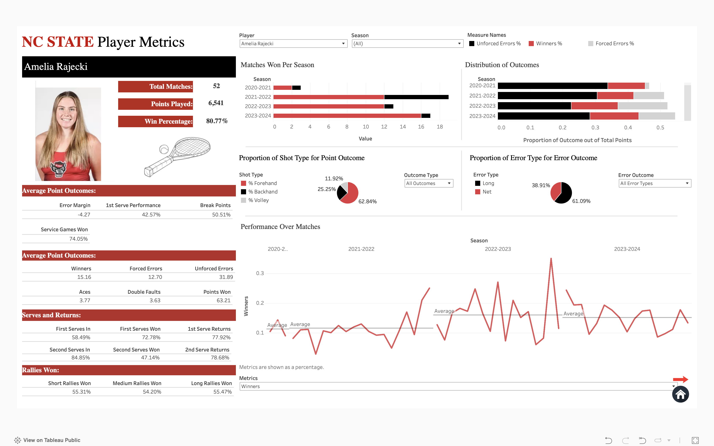

## Technical Skills
**Programming:** Python, R, SQL, VBA    
**Software:** Excel, Tableau, SPSS, Arena Simulation Software, Salesforce
**Certifications:** PCEP—Certified Entry Level Python Programmer

## Contact Information
**Phone Number:** 919-441-3173     
**Email:** ltswinto@ncsu.edu    
**LinkedIn:** www.linkedin.com/in/louisa-swintosky

## Education
**M.S. in Analytics** (May 2025)      
Institute for Advanced Analytics | NC State University | Raleigh, NC

**B.S. in Statistics and Analytics; B.A. in Psychology; Minor in Neuroscience** _with Highest Distinction_	(May 2023)    
University of North Carolina | Chapel Hill, NC

**About Me**
- I’m Louisa, a data enthusiast with a background in statistics and psychology.
- I'm passionate about data analytics, machine learning, and data ethics, driven by my curiosity for uncovering trends and insights.
- Beyond data, I'm an avid reader, a fan of games, and a movie lover. I also enjoy listening to podcasts, scuba diving, and traveling. 

## Projects

**Current and Future Projects**

### NCSU Women's Tennis Dashboard
[Dashboard](https://public.tableau.com/app/profile/louisa.swintosky/viz/NCStateWomensTennisMetrics-Orange5/HomePage)

Designed and developed a dynamic Tableau dashboard for NCSU Women's Tennis, visualizing player statistics, match outcomes, and performance.

_Dashboard Player Card Page_

### Airport Data Dashboard
[Dashboard]([Predicting_NFL_Outcomes_Based_on_Weather.pdf](https://lswintosky.shinyapps.io/Airport_Data_Dashboard/))

_Dashboard Player Card Page_

**Personal:**
- [Movie and TV Show Repository: A Collection of My Cinematic Favorites](https://github.com/louisaswin/movierepository-)
- [Wordle Analysis: Exploring Strategies and Optimization](https://github.com/louisaswin/Wordle-Project)

**Work:**
- [Groundwater Project](https://github.com/louisaswin/groundwater)
